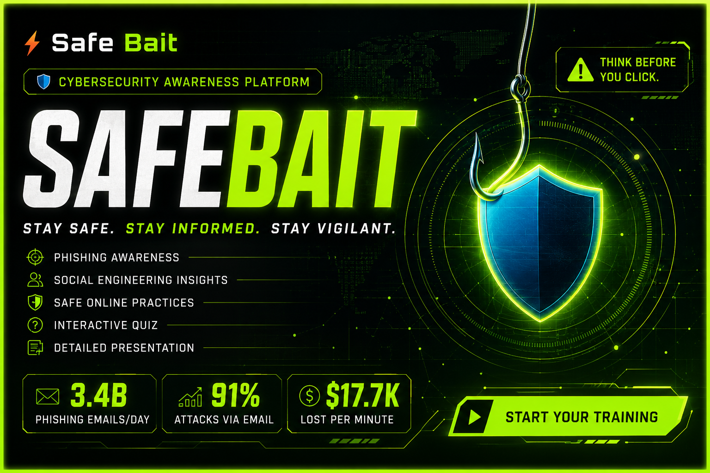

# SafeBait — Interactive Phishing Awareness Platform



> A futuristic, interactive cybersecurity awareness platform built with HTML, CSS & JavaScript.

---

## 🚀 Features

- 🛡️ **Hero Section** — Animated cyber background + particle network
- 🎣 **What is Phishing** — Beginner-friendly explanation with glowing cards
- ⚠️ **Types of Phishing** — Email, Smishing, Vishing, Spear, Clone, Whaling
- 🆚 **Real vs Fake Email** — Side-by-side phishing comparison
- 🧠 **Social Engineering** — Terminal-style animated section
- 🔐 **Safety Tips** — 6 glassmorphism cards with hover effects
- 🎯 **Interactive Quiz** — 10 questions, score tracking, results
- 📊 **Presentation Section** — View/Download PDF support
- 💡 **CTA Section** — "Think Before You Click" finale
- 📱 **Fully Responsive** — Mobile + Desktop optimized

---

## 🎨 Tech Stack

| Technology | Purpose |
|-----------|---------|
| HTML5 | Structure & Semantics |
| CSS3 | Cyberpunk Styling + Glassmorphism |
| JavaScript (ES6+) | Interactivity, Quiz, Animations |
| Google Fonts | Orbitron + Poppins + Share Tech Mono |
| Canvas API | Particle network background |
| IntersectionObserver | Scroll animations |

---

## 📁 File Structure

```
SafeBait/
├── index.html              # Main HTML
├── style.css               # All styles (cyberpunk theme)
├── script.js               # Quiz, particles, animations
├── assets/
│   ├── images/             # Hero + section images
│   ├── icons/              # SVG icons
│   └── presentation/
│       └── SafeBait-Presentation.pdf
└── README.md
```

---

## ⚡ Quick Start

1. Clone or download the project
2. Open `index.html` in any modern browser
3. No build tools or dependencies needed!

```bash
git clone https://github.com/yourusername/safebait.git
cd safebait
# Open index.html in browser
```

---

## 📊 Quiz Topics Covered

- Phishing email identification
- Social engineering tactics
- MFA & password security
- Smishing & Vishing
- URL verification
- Safe Wi-Fi practices

---

## 🎯 About

Built as part of a **Cybersecurity Awareness Internship Project** at CodeAlpha.

> "Think Before You Click." — SafeBait

---

## 📄 License

MIT License — Free to use for educational purposes.
